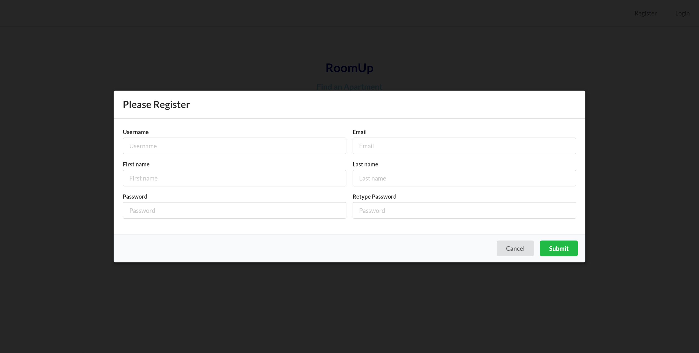
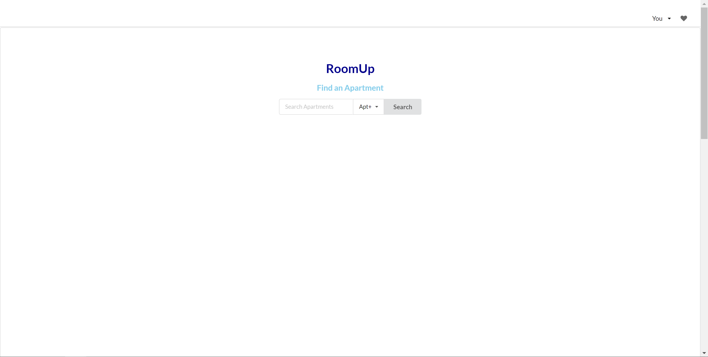
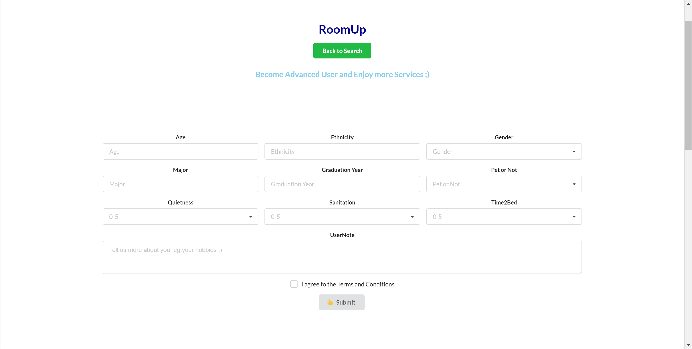
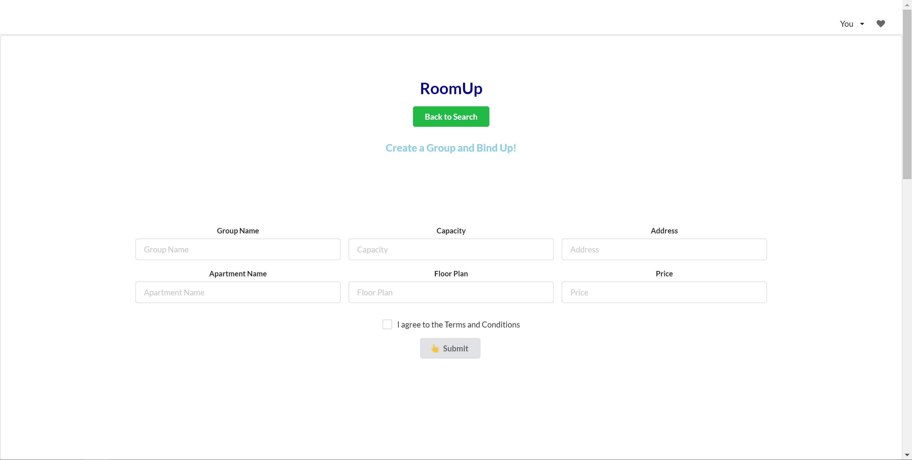
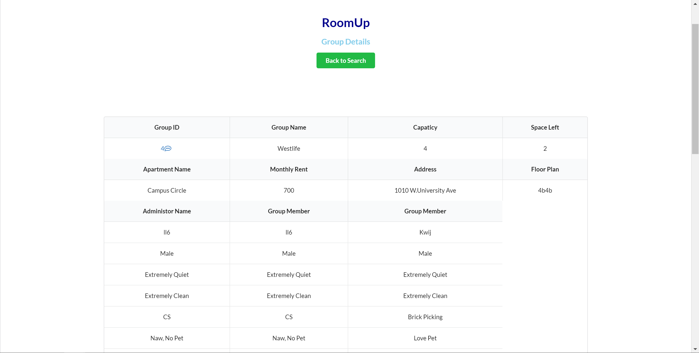
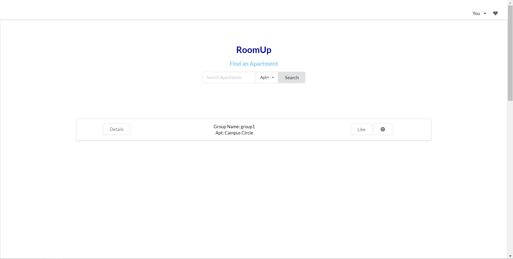
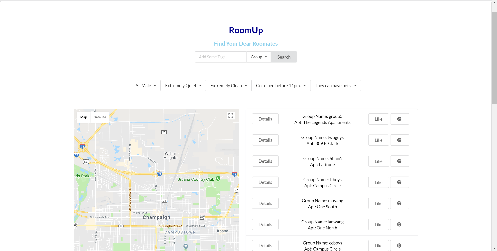
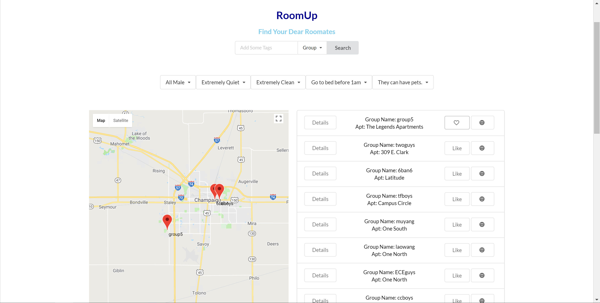

# RoomUp
A clean designed website that enables UIUC students to find their roommates and expands their social network

Demo website url: http://18.219.12.38:8001/

It is a project done by JieCheng Luo, Song Shu, Ran Ang, and Me. We dedicated ourselves to building a reliable roommate matching platform cause it is often harder to find reliable roommates than to find apartments. The original project link is here: https://github.com/TastyPeach/RoomUp

The website supports creating user, updating user to advance user with providence of further info. It allows advance users to create groups. Groups are consider as one user already has a apartment, and he wants to find roomates. Users can add to certain groups if interested, but only one user can only belong to one group, that means either he forms a group himself, or he joins a group. Users can search for a group a user is in given the user's username, or they can search for groups around a certain apartment, or they can search based on filters about what kind of the characteristics of roomates they are looking for. Once they find the targeted group, they can like a group and store their favorite groups into a "shopping cart" called potential match, so that they can view them on a map with markers on, for better comparison. Users can, of course, leave a group if they have better choices. Each group also has a group chat room so that they can communicate for further infomartion in real time.

The part where I am responsible for are backend api of group related operation, including building the chat room.
